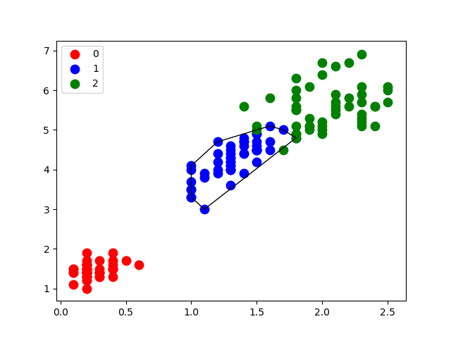
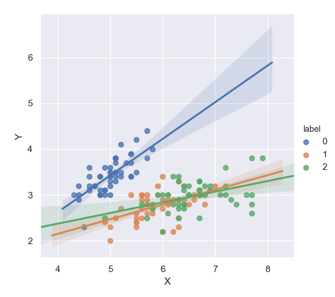

+ [matplotlib的一些基础](data_visualization.md)

| [base.py](base.py)                               |                                           |
|--------------------------------------------------|-------------------------------------------------------------------------|
| [pie.py](pie.py)                                 |                                                      |
| [scatter with encircling.py](scatter.py)         |                  |
| [scatter with line of best fit.py](scatterWL.py) |  |
