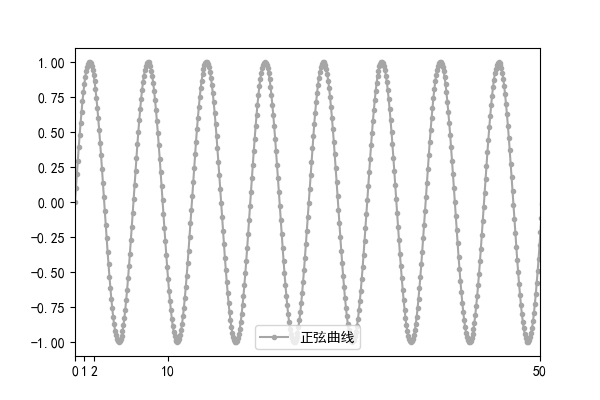

+ [matplotlib中文乱码看这里](data_visualization.md)

|                [base.py](base.py)                |                                                 |
|:------------------------------------------------:|:-----------------------------------------------------------------------------:|
|                 [pie.py](pie.py)                 |                                                                |
|     [scatter with encircling.py](scatter.py)     |                    |
| [scatter with line of best fit.py](scatterWL.py) |  |
|     [jittering with stripplot.py](jitter.py)     |                      |
|         [Counts Plot.py](countplot.py)         |                                                |
